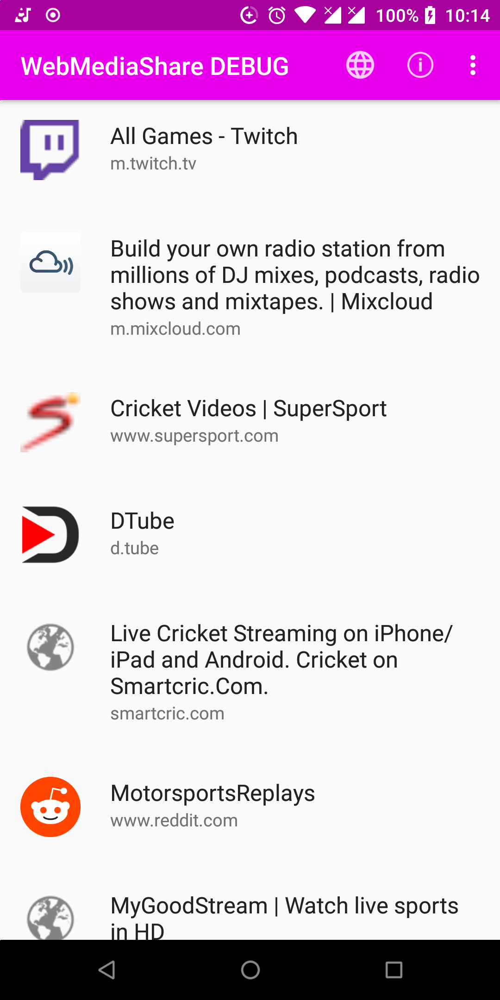
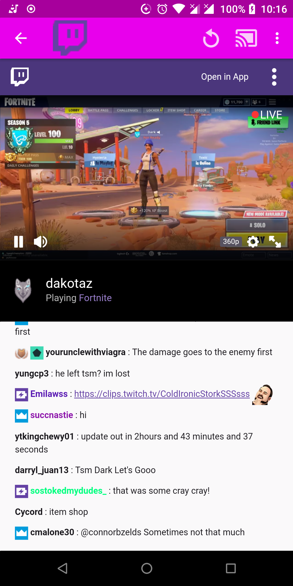

WebMediaShare - web media your way!
=============

  

WebMediaShare is an app to browse your favourite media websites (e.g. online streaming sites, online radio stations, etc.)  so that you can:

  - view the content without ads/popups/redirects/etc. 
  - listen to music from a streaming site in a media player app like VLC, so that it continues playing even if the screen is off
  - send the media to your TV or Hifi (e.g. via the Kore app for Kodi). This works like Chromecast, but without the need for the Chromecast device, a Google account or Google Play Services, or special support for the site.
  - share the media URL to friends on chats or email
  - share the media to an app for downloading

WebMediaShare is a browser with the following features:

  - Save your favourite media sites in-app
  - Add shortcuts to the home screen so that they open like regular apps
  - Ad blocking
  - Prevents popups, popunders, and redirects
  - intercepts media within web pages, allowing you to view and share them

Forked from https://github.com/tobykurien/WebApps

Limitations
===========

- Cookies and referer information is lost when sharing a media URL, so it may not work on some sites if the server requires these.
- Casting does not work well for sites like YouTube.com that stream their media in several chunked files
  - For YouTube in particular, use "Share URL" menu option to share to Kore. Your Kodi instance will need the YouTube plugin installed.
